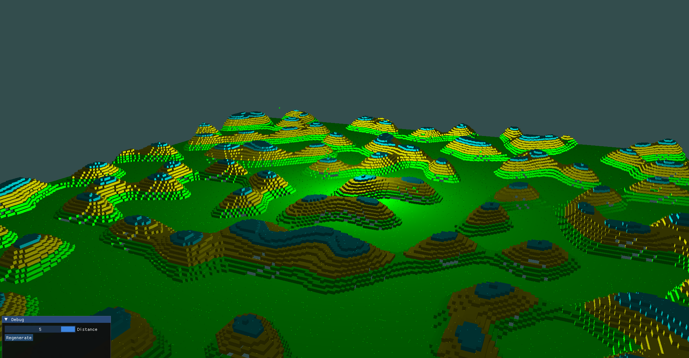

# Revox
A bare-bones beginning of a Sparse Voxel Octree (SVO) based engine with rasterized, naively meshed chunks and Simplex noise based terrain generation.

Depends on IMGui, GLFW, Opengl3, FastNoiseLite.
Will probably need a little project cleanup before it's publicly buildable.

### Possible goals
* Swap rendering backend to ray-tracing for fun and to avoid the headaches of chunk meshing
* Improve insertion efficiency to greatly reduce terrain generation time

